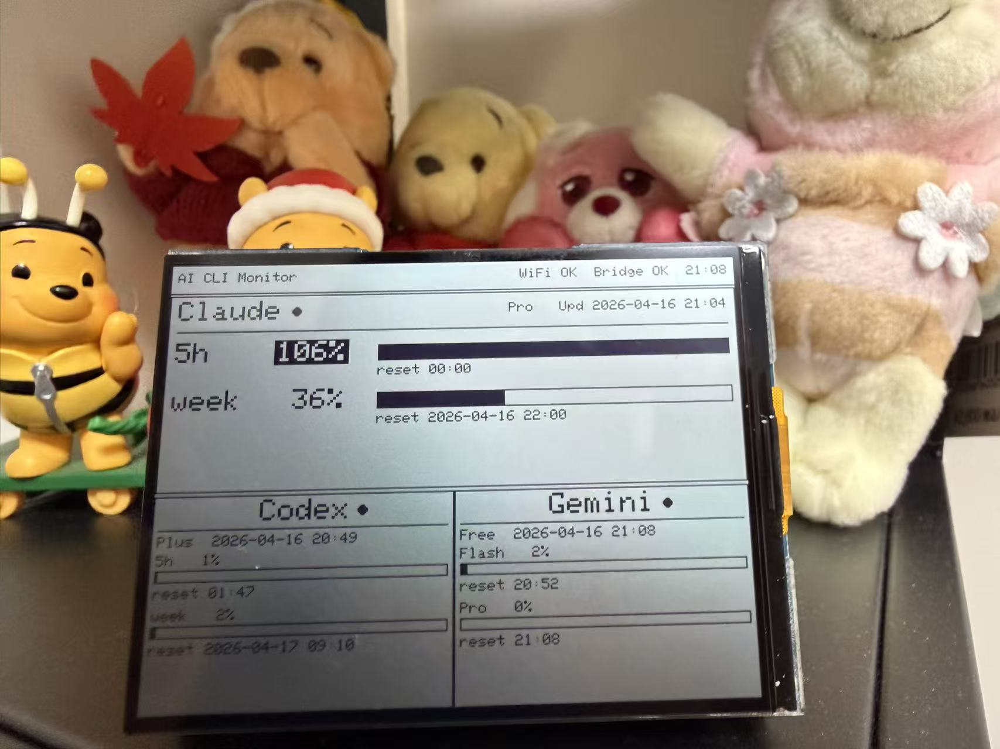
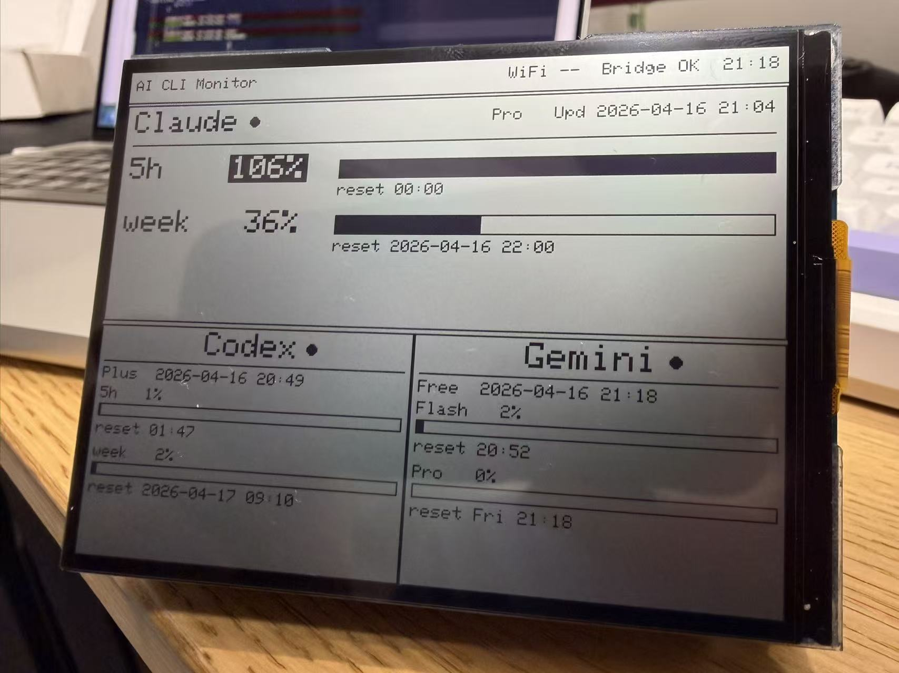

# CLI Quota Monitor

[English](README.md)

CLI Quota Monitor 是一个基于 ESP32 的本地优先桌面显示器项目，用来展示终端 AI 工具的额度、限流窗口和使用状态。

当前版本默认适配 Waveshare `ESP32-S3-RLCD-4.2`，展示以下工具的数据：

- Claude Code
- OpenAI Codex CLI
- Gemini CLI

## 成品预览

<p align="center">
  
  
</p>

## 功能特性

- 本地优先架构，ESP32 只轮询你局域网内的 bridge
- 一个仪表盘同时展示多个 CLI 工具的额度状态
- 设备自带配置页面，可设置 Wi-Fi 和 bridge 地址
- 固件基于 Arduino IDE，而不是上游的 PlatformIO 结构
- 显示层基于 `Adafruit_GFX` 兼容抽象，方便适配其他面板

## 架构说明

项目运行时分成两部分：

- `esp32-firmware/`：运行在 ESP32 上的 Arduino 固件
- `mac-bridge/`：运行在电脑上的 Python bridge，通过 HTTP 对外提供本地使用数据

ESP32 不会直接调用厂商 API，而是连接本地 Wi-Fi 后轮询局域网中的 bridge，再将汇总结果渲染到屏幕上。

bridge 当前会读取：

- Claude Code 的限流缓存：`/tmp/cc-display-claude.json`
- Codex 会话使用数据：`~/.codex/sessions`
- Gemini 配额状态：`~/.gemini/oauth_creds.json`

## 仓库结构

```text
esp32-firmware/   ESP32 显示设备固件
mac-bridge/       本地 CLI 使用数据的 Python HTTP bridge
README.md         英文说明
README.zh-CN.md   中文说明
LICENSE           MIT 许可证
NOTICE            上游项目署名说明
```

## 硬件与软件要求

硬件：

- Waveshare `ESP32-S3-RLCD-4.2`

固件环境：

- Arduino IDE
- ESP32 开发板支持包
- `ArduinoJson` 7.3.0 或更新版本
- `Adafruit GFX Library`
- 一个兼容的显示驱动

代码中已经参考过的驱动包括：

- `Arduino_GFX_Library`
- `GxEPD2`
- 仓库内置的 `gfx_waveshare_rlcd.h` 适配层

bridge 环境：

- Python 3
- 能访问需要展示数据的本地 CLI 文件或凭证
- 如果要启用 Gemini 配额刷新，需要在启动 bridge 前设置 `GEMINI_OAUTH_CLIENT_ID` 和 `GEMINI_OAUTH_CLIENT_SECRET`

## Claude Code 辅助脚本

`mac-bridge/status-line.sh` 是给 Claude Code 用的可选辅助脚本。它会从 Claude Code 的 stdin 中读取限流信息，并缓存到本地，供 bridge 使用。

Claude Code 配置示例：

```json
{
  "statusLine": {
    "type": "command",
    "command": "/absolute/path/to/mac-bridge/status-line.sh"
  }
}
```

如果你修改缓存文件路径，需要同时修改：

- `mac-bridge/status-line.sh`
- `mac-bridge/bridge_server.py`

## 快速开始

### 1. 启动 bridge

```bash
cd mac-bridge
python3 bridge_server.py
```

默认监听地址为 `0.0.0.0:8899`。

### 2. 烧录 ESP32 固件

在 Arduino IDE 中打开 `esp32-firmware/esp32-firmware.ino`，然后：

- 安装依赖库
- 确认显示驱动配置与你的硬件一致
- 编译并上传

### 3. 配置设备

如果设备还没有配置 Wi-Fi，会启动一个类似下面的热点：

```text
CCDisplay-XXXX
```

打开配置页面后填写：

- 你的 Wi-Fi 名称和密码
- 运行 bridge 的电脑在局域网中的 IP
- bridge 端口，通常是 `8899`

保存后设备会自动重启，并开始轮询 bridge。

## Bridge 接口

- `GET /health`：健康检查
- `GET /usage`：ESP32 使用的汇总数据接口

bridge 默认绑定 `0.0.0.0`。如果你要暴露到不受信任的网络，需要自己加访问控制。

## 安全与隐私

- 设计目标是运行在受信任的本地网络中
- bridge 会读取本机上的 CLI 元数据和额度状态
- Gemini 配额读取依赖本机已有的 Gemini CLI OAuth 凭证
- Gemini token 刷新还需要由本地环境提供 `GEMINI_OAUTH_CLIENT_ID` 和 `GEMINI_OAUTH_CLIENT_SECRET`
- 如果要给其他用户或设备开放，请先审阅 `mac-bridge/bridge_server.py`

## 项目状态

这不是上游仓库的直接延续，而是一个派生项目。主要差异包括：

- 硬件目标不同
- 使用 Arduino IDE，而不是上游的构建流程
- 使用本地 bridge 架构，而不是原始的云端集成方式
- 监控的服务不同
- 项目范围聚焦在 ESP32 设备和本地 bridge

## 署名说明

本项目最初基于 `dorofino/ClaudeGauge` 的代码演化而来，之后针对硬件、工具链、架构和监控对象做了大量修改。

详细说明见 [NOTICE](NOTICE)。

## 许可证

本项目以 MIT License 开源，详见 [LICENSE](LICENSE)。
